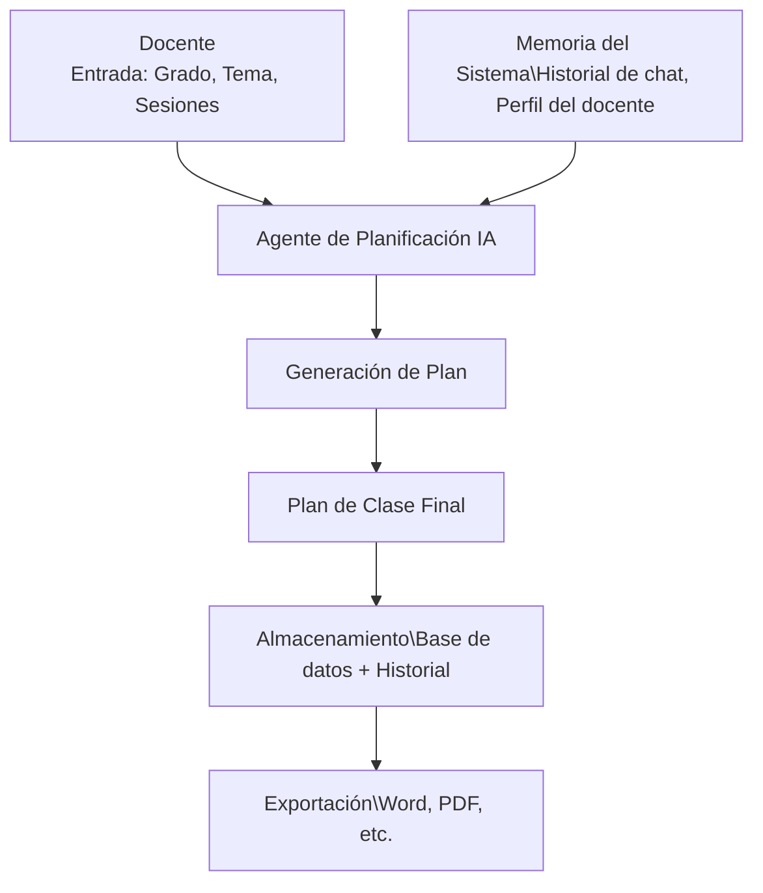
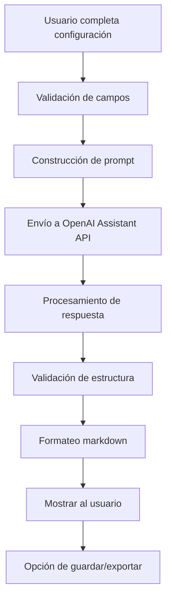
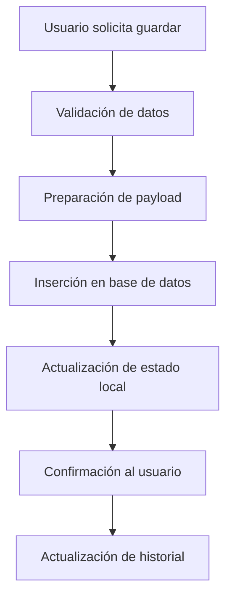
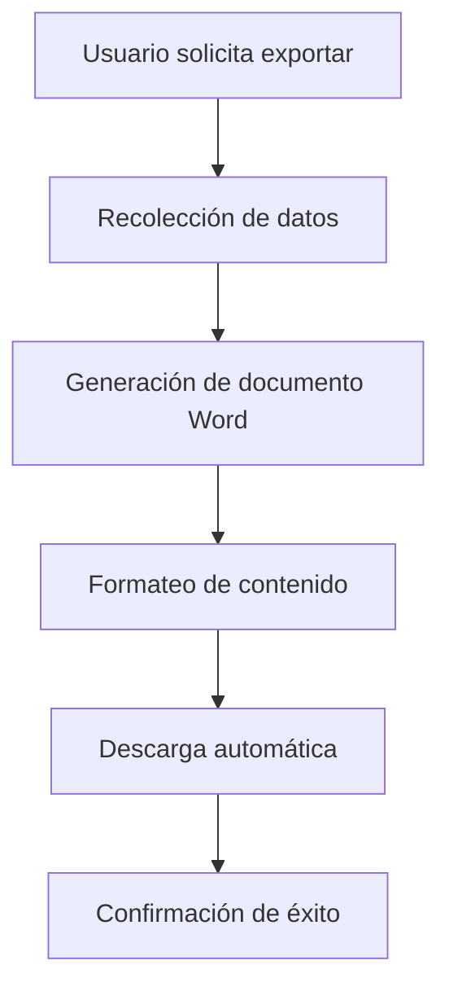
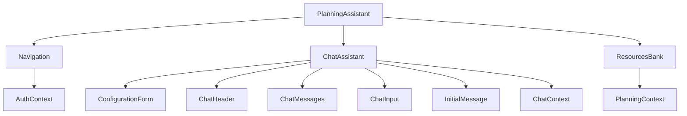

# 🎓 Planeador Didáctico Inteligente - IE Camilo Torres

[](https://nextjs.org/)
[](https://www.typescriptlang.org/)
[](https://supabase.com/)
[](https://platform.openai.com/)

> **Sistema de generación automática de planes de clase** utilizando inteligencia artificial, diseñado específicamente para docentes de Tecnología e Informática de la Institución Educativa Camilo Torres.

## 📋 Tabla de Contenidos

- [🎯 Descripción General](#-descripción-general)
- [🏗️ Arquitectura del Sistema](#️-arquitectura-del-sistema)
- [⚡ Características Principales](#-características-principales)
- [🛠️ Stack Tecnológico](#️-stack-tecnológico)
- [📁 Estructura del Proyecto](#-estructura-del-proyecto)
- [🚀 Instalación y Configuración](#-instalación-y-configuración)
- [💻 Uso del Sistema](#-uso-del-sistema)
- [🔧 API y Servicios](#-api-y-servicios)
- [📊 Base de Datos](#-base-de-datos)
- [🎨 Componentes Principales](#-componentes-principales)
- [📈 Flujos de Datos](#-flujos-de-datos)
- [🔒 Seguridad](#-seguridad)
- [📝 Contribución](#-contribución)
- [📄 Licencia](#-licencia)

---

## 🎯 Descripción General
El **Planeador Didáctico Inteligente** es un sistema web avanzado que utiliza inteligencia artificial para generar planes de clase completos y estructurados. Está diseñado específicamente para docentes del área de **Tecnología e Informática** de la Institución Educativa Camilo Torres.

### 🎯 Objetivos

- **Automatizar** la creación de planes de clase didácticos
- **Alinear** con políticas educativas nacionales (MEN 2022)
- **Integrar** el modelo pedagógico crítico-social
- **Facilitar** la evaluación con criterios oficiales (Tabla 7)
- **Optimizar** el tiempo de planeación docente

### 🎓 Público Objetivo

- Docentes de Tecnología e Informática
- Coordinadores académicos
- Directivos docentes
- Estudiantes de pedagogía

---

## 🏗️ Arquitectura del Sistema

### 📊 Diagrama de Flujo Principal



---

## ⚡ Características Principales

### 🎯 Generación Inteligente
- **Planes de clase completos** con estructura pedagógica
- **Alineación automática** con PEI y MEN 2022
- **Integración de competencias** según grado y tema
- **Evaluación con Tabla 7** (criterios oficiales)

### 📚 Gestión de Planeaciones
- **Historial de planeaciones** organizado
- **Exportación a Word** con formato profesional

### 💬 Interfaz Intuitiva
- **Chat interactivo** con asistente IA
- **Formularios inteligentes** con validación
- **Exportación a Word** con formato profesional
- **Historial de planeaciones** organizado

### 🔒 Seguridad y Confiabilidad
- **Autenticación robusta** con Supabase
- **Validación de datos** en frontend y backend
- **Políticas RLS** para protección de datos
- **Anti-alucinación** en respuestas de IA

---

## 📈 Flujos de Datos

### 🔄 Flujo de Datos Principal

```sequenceDiagram
    participant Docente
    participant Agente
    participant BaseDeDatos as "Base de Datos"
    participant Gemini as "Gemini AI"
    participant Exportacion as "Exportación"

    Docente ->> Agente: Configuración inicial
    Agente ->> BaseDeDatos: Consulta documentos
    BaseDeDatos -->> Agente: Documentos relevantes
    Agente ->> Gemini: Generación de plan
    Gemini -->> Agente: Plan estructurado
    Agente ->> Agente: Aplicar guardrails
    Agente -->> Docente: Plan de clase final

    Docente ->> Agente: Solicitar guardado
    Agente ->> BaseDeDatos: Almacenar plan

    Docente ->> Agente: Solicitar exportación
    Agente ->> Exportacion: Generar Word/PDF
    Exportacion -->> Docente: Archivo descargado

```


### 🔄 Flujo de Generación de Plan



### 💾 Flujo de Persistencia



### 📤 Flujo de Exportación



---

## 🛠️ Stack Tecnológico

### Frontend
- **Next.js 14** - Framework React con App Router
- **TypeScript** - Tipado estático
- **Tailwind CSS** - Framework de estilos
- **React Context** - Gestión de estado global
- **Custom Hooks** - Lógica reutilizable

### Backend
- **Supabase** - Backend as a Service
- **PostgreSQL** - Base de datos relacional

### IA y Procesamiento
- **OpenAI Assistant API (GPT-4)** - Modelo de lenguaje para generación de planes y chat
- **Prompt Engineering** - Optimización de prompts

### Herramientas de Desarrollo
- **ESLint** - Linting de código
- **Prettier** - Formateo de código
- **Git** - Control de versiones
- **Vercel** - Despliegue (opcional)

---

## 📁 Estructura del Proyecto

```
tutor-agente-ia/
├── 📁 app/                          # Next.js App Router
│   ├── 📁 api/                      # API Routes
│   │   ├── 📁 admin/                # Rutas de administración
│   │   └── 📁 chat/                 # Rutas de chat
│   ├── globals.css                  # Estilos globales
│   ├── layout.tsx                   # Layout principal
│   └── page.tsx                     # Página principal
├── 📁 components/                   # Componentes React
│   ├── 📁 ui/                       # Componentes UI base
│   │   ├── button.tsx               # Botones
│   │   ├── input.tsx                # Inputs
│   │   ├── label.tsx                # Labels
│   │   ├── toast.tsx                # Notificaciones
│   │   ├── toaster.tsx              # Contenedor de toasts
│   │   └── use-toast.ts             # Hook de toast
│   ├── ChatAssistant.tsx            # Chat principal
│   ├── ChatHeader.tsx               # Header del chat
│   ├── ChatInput.tsx                # Input del chat
│   ├── ChatMessages.tsx             # Mensajes del chat
│   ├── ConfigurationForm.tsx        # Formulario de configuración
│   ├── InitialMessage.tsx           # Mensaje inicial
│   ├── Navigation.tsx               # Navegación
│   ├── PlanningAssistant.tsx        # Layout principal
│   ├── ResourcesBank.tsx            # Banco de recursos
│   └── UserAdmin.tsx                # Administración de usuarios
├── 📁 contexts/                     # Contextos React
│   ├── AppProvider.tsx              # Proveedor principal
│   ├── AuthContext.tsx              # Contexto de autenticación
│   ├── ChatContext.tsx              # Contexto del chat
│   ├── NavigationContext.tsx        # Contexto de navegación
│   └── PlanningContext.tsx          # Contexto de planeación
├── 📁 hooks/                        # Custom Hooks
│   ├── useAuth.ts                   # Hook de autenticación
│   ├── useChatActions.ts            # Hook de acciones del chat
│   ├── usePlanningActions.ts        # Hook de acciones de planeación
│   └── index.ts                     # Exportaciones
├── 📁 lib/                          # Servicios y utilidades
│   ├── 📁 supabase/                 # Cliente Supabase
│   │   ├── admin.ts                 # Cliente admin
│   │   ├── client.ts                # Cliente público
│   │   └── server.ts                # Cliente servidor
│   ├── openai-assistant-service.ts   # Servicio de IA (OpenAI Assistant)
│   ├── pdf-content-processor.ts     # Procesador de PDFs
│   └── utils.ts                     # Utilidades generales
├── 📁 types/                        # Tipos TypeScript
│   └── index.ts                     # Definiciones de tipos
├── 📁 utils/                        # Utilidades
│   ├── markdown.ts                  # Procesador de markdown
│   └── index.ts                     # Exportaciones
├── 📁 public/                       # Archivos estáticos
│   └── placeholder.svg              # Imagen placeholder
├── 📁 scripts/                      # Scripts de base de datos
│   └── 008_setup_admin_user.sql     # Configuración de admin
├── package.json                     # Dependencias
├── tsconfig.json                    # Configuración TypeScript
├── tailwind.config.js               # Configuración Tailwind
├── next.config.mjs                  # Configuración Next.js
└── README.md                        # Este archivo
```

---

## 🚀 Instalación y Configuración

### 📋 Prerrequisitos

- **Node.js** 18.0 o superior
- **npm** o **pnpm** (recomendado)
- **Git** para clonar el repositorio
- **Cuenta de Supabase** para backend
- **API Key de OpenAI** para IA

### 🔧 Instalación

1. **Clonar el repositorio**
   ```bash
   git clone https://github.com/tu-usuario/tutor-agente-ia.git
   cd tutor-agente-ia
   ```

2. **Instalar dependencias**
   ```bash
   npm install
   # o
   pnpm install
   ```

3. **Configurar variables de entorno**
   ```bash
   cp .env.example .env.local
   ```

4. **Configurar variables en `.env.local`**
   ```env
   # Supabase
   NEXT_PUBLIC_SUPABASE_URL=tu_url_supabase
   NEXT_PUBLIC_SUPABASE_ANON_KEY=tu_anon_key
   
   # OpenAI Assistant
   OPENAI_API_KEY=tu_openai_api_key
   ASSISTANT_ID=tu_assistant_id
   
   # Opcional: Claves de administración
   SUPABASE_SERVICE_ROLE_KEY=tu_service_role_key
   ```

5. **Configurar base de datos**
   ```bash
   # Ejecutar scripts SQL en Supabase
   # Ver sección de Base de Datos
   ```

6. **Ejecutar en desarrollo**
   ```bash
   npm run dev
   # o
   pnpm dev
   ```

7. **Abrir en el navegador**
   ```
   http://localhost:3000
   ```

### 🗄️ Configuración de Base de Datos

1. **Crear proyecto en Supabase**
2. **Ejecutar scripts SQL** (ver sección Base de Datos)
3. **Configurar políticas RLS**

---

## 💻 Uso del Sistema

### 🎯 Flujo de Trabajo Principal

#### 1. **Configuración Inicial**
- Acceder a la aplicación
- Completar formulario de configuración:
  - **Grado**: 1° a 11°
  - **Asignatura**: Tecnología e Informática (fijo)
  - **Tema**: Tema específico a enseñar
  - **Sesiones**: 1 o 2 sesiones (2-4 horas)
  - **Recursos**: Recursos disponibles
  - **Nombre del docente**: Nombre completo

#### 2. **Generación de Plan**
- Iniciar conversación con el asistente
- Solicitar plan de clase específico
- El sistema genera plan estructurado y completo

#### 3. **Revisión y Edición**
- Revisar el plan generado
- Solicitar modificaciones si es necesario
- El asistente ajusta según solicitudes

#### 4. **Guardado y Exportación**
- Guardar el chat en el banco de recursos
- Exportar a documento Word
- Reutilizar en futuras planeaciones

### 🎨 Interfaz de Usuario

#### **Pestaña "Generar"**
- Formulario de configuración
- Chat interactivo con asistente
- Botones de acción (enviar, limpiar, guardar)

#### **Pestaña "Historial"**
- Lista de planeaciones guardadas
- Búsqueda y filtrado
- Visualización de chats completos
- Exportación individual

---

## 🎨 Componentes Principales

### 🏗️ Arquitectura de Componentes



### 📱 Componentes Clave

#### **PlanningAssistant.tsx**
- **Propósito**: Componente principal y coordinador
- **Estado**: Navegación, datos de planeación
- **Contextos**: Auth, Navigation, Planning

#### **ChatAssistant.tsx**
- **Propósito**: Interfaz de chat principal
- **Funcionalidades**: Configuración, chat, exportación
- **Estado**: Mensajes, configuración, carga

#### **ResourcesBank.tsx**
- **Propósito**: Gestión de historial
- **Funcionalidades**: Lista, búsqueda, exportación
- **Estado**: Planeaciones, filtros

#### **ConfigurationForm.tsx**
- **Propósito**: Formulario de configuración inicial
- **Validación**: Campos obligatorios, formatos
- **Estado**: Configuración de planeación

### 🎯 Contextos de Estado

#### **AuthContext**
```typescript
interface AuthContextType {
  user: User | null
  loading: boolean
  isAdmin: boolean
  isAuthenticated: boolean
  signOut: () => Promise<void>
}
```

#### **ChatContext**
```typescript
interface ChatContextType {
  messages: Message[]
  isConfigured: boolean
  planningConfig: PlanningConfig
  isLoading: boolean
  isSaving: boolean
  // ... acciones
}
```

---

## 🔧 API y Servicios

### 🤖 Servicio de IA (OpenAI Assistant)

```typescript
// lib/openai-assistant-service.ts
export async function getOpenAIResponse(context: {
  message: string;
  planningConfig?: any;
  chatHistory?: any[];
}): Promise<{ answer: string }>
```

**Características:**
- Modelo: `gpt-4` (o el modelo configurado en OpenAI)
- Prompt engineering optimizado con contexto, historial y configuración inicial
- Respuestas estructuradas y formateadas en Markdown
- Integración segura vía backend (la API Key nunca se expone al frontend)

#### Conexión y configuración

1. **Obtener una API Key de OpenAI** desde https://platform.openai.com/api-keys
2. **Configurar variables en `.env.local`:**
   ```env
   # OpenAI
   OPENAI_API_KEY=sk-...
   ASSISTANT_ID=asst_...
   ```
3. **El backend se encarga de:**
   - Recibir el mensaje, configuración y contexto del usuario
   - Construir el prompt enriquecido
   - Llamar a la API de OpenAI Assistant
   - Devolver la respuesta al frontend

4. **El frontend solo interactúa con el backend** mediante endpoints `/api/chat/openai`.

---

## 📊 Base de Datos

### 🗄️ Esquema Principal

#### **Tabla: planeaciones**
```sql
CREATE TABLE planeaciones (
  id UUID PRIMARY KEY DEFAULT gen_random_uuid(),
  grado VARCHAR(10) NOT NULL,
  tema TEXT NOT NULL,
  duracion VARCHAR(20) NOT NULL,
  sesiones INTEGER NOT NULL,
  contenido JSONB,
  chat_history JSONB,
  created_at TIMESTAMP DEFAULT NOW(),
  user_id UUID REFERENCES auth.users(id)
);
```

---

## 🔒 Seguridad

### 🛡️ Medidas de Seguridad Implementadas

#### **Autenticación y Autorización**
- Autenticación con Supabase Auth
- Políticas RLS en base de datos
- Verificación de roles de usuario
- Tokens JWT seguros

#### **Validación de Datos**
- Validación en frontend (TypeScript)
- Sanitización de inputs
- Validación de tipos
- Escape de caracteres especiales

#### **Protección de API**
- Rate limiting en endpoints
- Validación de API keys
- CORS configurado
- Headers de seguridad

#### **Protección de IA**
- Filtrado de prompts maliciosos
- Validación de respuestas
- Anti-alucinación
- Límites de tokens

---

## 📝 Contribución

### 🤝 Cómo Contribuir

1. **Fork** el repositorio
2. **Crear** una rama para tu feature (`git checkout -b feature/nueva-funcionalidad`)
3. **Commit** tus cambios (`git commit -m 'feat: agregar nueva funcionalidad'`)
4. **Push** a la rama (`git push origin feature/nueva-funcionalidad`)
5. **Abrir** un Pull Request

### 📋 Estándares de Código

#### **TypeScript**
- Tipado estricto habilitado
- Interfaces bien definidas
- Evitar `any` cuando sea posible
- Documentación de tipos complejos

#### **React**
- Componentes funcionales
- Hooks personalizados para lógica
- Props tipadas
- Estado inmutable

#### **Estilos**
- Tailwind CSS para estilos
- Clases semánticas
- Responsive design
- Consistencia visual

#### **Commits**
- `feat:` nueva funcionalidad
- `fix:` corrección de bugs
- `docs:` documentación
- `style:` formato de código
- `refactor:` refactorización
- `test:` pruebas

### 🧪 Testing

```bash
# Ejecutar tests
npm run test

# Tests con coverage
npm run test:coverage

# Tests de integración
npm run test:integration
```

### 📚 Documentación

- README actualizado
- Comentarios en código complejo
- JSDoc para funciones públicas
- Diagramas actualizados

---

## 📄 Licencia

Este proyecto está bajo la Licencia MIT. Ver el archivo [LICENSE](LICENSE) para más detalles.

---

## 📞 Soporte y Contacto

- **Email**: soporte@ie-camilo-torres.edu.co
- **Documentación**: [Wiki del proyecto](https://github.com/tu-usuario/tutor-agente-ia/wiki)
- **Issues**: [GitHub Issues](https://github.com/tu-usuario/tutor-agente-ia/issues)
- **Discusiones**: [GitHub Discussions](https://github.com/tu-usuario/tutor-agente-ia/discussions)

---

<div align="center">

**Desarrollado con ❤️ para la educación colombiana**

[⬆️ Volver al inicio](#-planeador-didáctico-inteligente---ie-camilo-torres)

</div>


