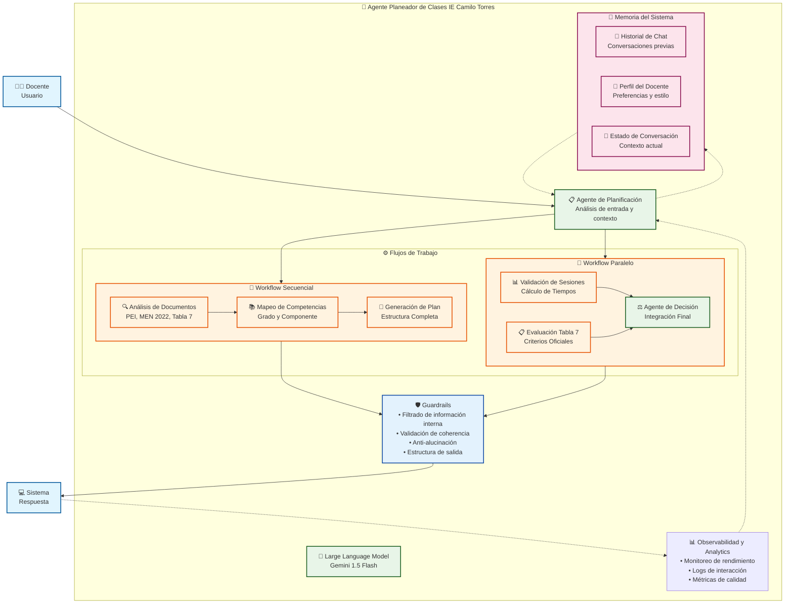

# 🧠 Arquitectura del Agente Planeador de Clases IE Camilo Torres

## Framework Agentic del Sistema

## 🔄 Flujo de Procesamiento

### 1. **Entrada del Usuario**
- Docente proporciona: grado, tema, sesiones, recursos, nombre
- Sistema valida campos obligatorios
- Contexto se almacena en memoria

### 2. **Agente de Planificación**
- Analiza la entrada del usuario
- Consulta documentos institucionales (PEI, MEN 2022, Tabla 7)
- Determina estrategia didáctica apropiada
- Planifica flujo de trabajo

### 3. **Workflow Secuencial**
- **Análisis de Documentos**: Recupera información relevante
- **Mapeo de Competencias**: Conecta tema con competencias del grado
- **Generación de Plan**: Crea estructura completa del plan de clase

### 4. **Workflow Paralelo**
- **Validación de Sesiones**: Calcula tiempos y distribuye momentos pedagógicos
- **Evaluación Tabla 7**: Selecciona criterios oficiales de evaluación
- **Agente de Decisión**: Integra ambos flujos en respuesta coherente

### 5. **Guardrails**
- Filtra información interna (cálculos, validaciones)
- Valida coherencia entre secciones
- Previene alucinaciones
- Mantiene estructura de salida definida

### 6. **Memoria y Aprendizaje**
- Almacena historial de conversaciones
- Mantiene perfil del docente
- Actualiza estado de conversación
- Permite adaptación y mejora continua

### 7. **Observabilidad**
- Monitorea rendimiento del sistema
- Registra interacciones y métricas
- Proporciona insights para mejora
- Genera reportes de calidad

## 🎯 Características Clave

- **Modularidad**: Componentes independientes y reutilizables
- **Escalabilidad**: Fácil adición de nuevos agentes y workflows
- **Seguridad**: Guardrails robustos para prevenir errores
- **Aprendizaje**: Memoria persistente para mejora continua
- **Monitoreo**: Observabilidad completa del sistema
- **Coherencia**: Integración perfecta con documentos institucionales
