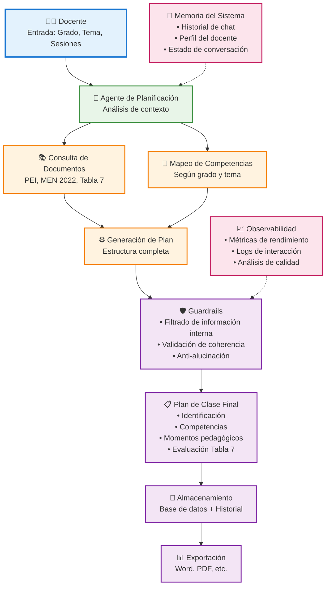
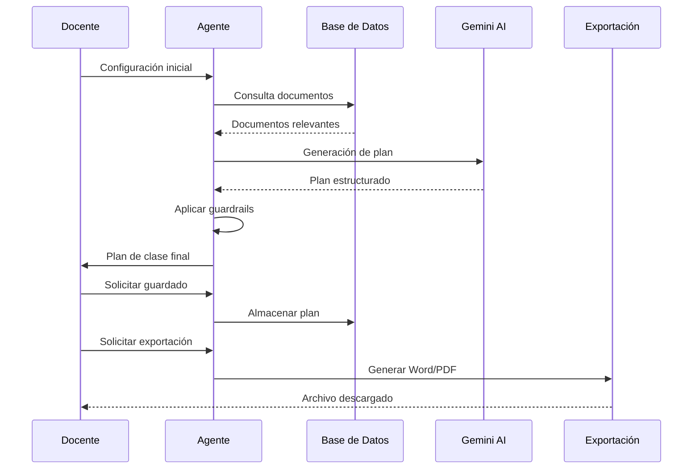

# 🏗️ Arquitectura del Agente Planeador de Clases

## Diagrama de Flujo Principal

## 🔄 Componentes del Sistema

### 1. **Entrada del Usuario**
- Formulario de configuración
- Validación de campos
- Contexto inicial

### 2. **Agente de Planificación**
- Análisis semántico del tema
- Selección de estrategia didáctica
- Coordinación de workflows

### 3. **Consulta de Documentos**
- Recuperación de PEI
- Integración de Orientaciones MEN 2022
- Aplicación de Tabla 7
- Incorporación de Revisión Sistemática

### 4. **Mapeo de Competencias**
- Identificación de componente curricular
- Selección de competencias por grado
- Conexión con evidencias de aprendizaje

### 5. **Generación de Plan**
- Estructura de 7 apartados
- Momentos pedagógicos (120 min exactos)
- Distribución proporcional de tiempos
- Roles del docente y estudiante

### 6. **Guardrails**
- Filtrado de información interna
- Validación de coherencia
- Prevención de alucinaciones
- Mantenimiento de estructura

### 7. **Almacenamiento y Exportación**
- Guardado en base de datos
- Historial de conversaciones
- Exportación a Word/PDF
- Reutilización de planes

## 🎯 Flujo de Datos

## 🛡️ Capas de Seguridad

1. **Validación de Entrada**: Campos obligatorios y formatos
2. **Consulta de Documentos**: Solo fuentes oficiales
3. **Generación Controlada**: Prompt estructurado y validado
4. **Guardrails**: Filtrado y validación de salida
5. **Almacenamiento Seguro**: Base de datos con RLS
6. **Exportación Controlada**: Formatos estándar y seguros
