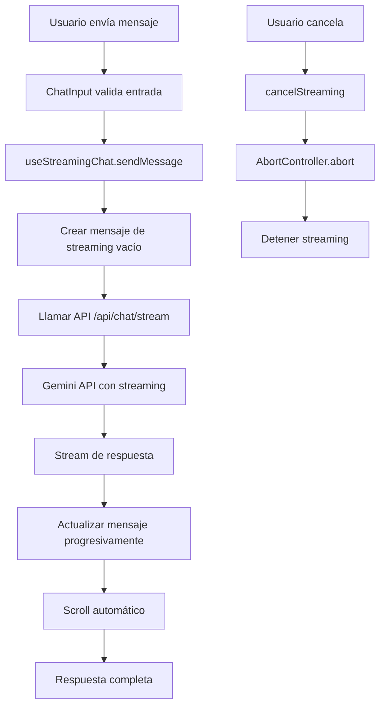

# 🚀 Implementación de Streaming en el Frontend

## 📋 Resumen

Se ha implementado streaming en tiempo real para la generación de respuestas del agente, mejorando significativamente la experiencia del usuario al mostrar la respuesta generándose progresivamente.

## 🏗️ Arquitectura de la Implementación

### 1. **Hook de Streaming** (`useStreamingChat.ts`)
- Maneja el estado de streaming
- Controla la cancelación de solicitudes
- Gestiona la actualización de mensajes en tiempo real
- Integra con el contexto de chat existente

### 2. **API Route de Streaming** (`/api/chat/stream/route.ts`)
- Endpoint específico para streaming
- Conecta directamente con Gemini API
- Retorna stream de respuesta en tiempo real
- Maneja errores y cancelación

### 3. **Componentes Actualizados**
- **ChatAssistant**: Usa el nuevo hook de streaming
- **ChatInput**: Muestra estado de streaming y permite cancelar
- **ChatMessages**: Indicadores visuales diferenciados

## 🎯 Características Implementadas

### ✅ **Streaming en Tiempo Real**
- Respuesta se genera token por token
- Actualización progresiva del mensaje
- Scroll automático durante la generación

### ✅ **Indicadores Visuales**
- **Cargando**: Puntos azules animados (antes del streaming)
- **Streaming**: Puntos verdes pulsantes (durante la generación)
- **Botón de envío**: Cambia a "Generando..." durante streaming

### ✅ **Control de Usuario**
- Botón de cancelar durante streaming
- Deshabilitación de input durante generación
- Manejo de errores y cancelación

### ✅ **Compatibilidad**
- No rompe funcionalidad existente
- Mantiene toda la lógica de chat actual
- Retrocompatible con modo no-streaming

## 🔧 Uso del Streaming

### **Para el Usuario**
1. Escribe un mensaje y presiona "Enviar"
2. Ve la respuesta generándose en tiempo real
3. Puede cancelar en cualquier momento con "Cancelar"
4. La respuesta se actualiza progresivamente

### **Para el Desarrollador**
```typescript
// Usar el hook de streaming
const { sendMessage, isStreaming, cancelStreaming } = useStreamingChat()

// Enviar mensaje con streaming
await sendMessage("Genera un plan de clase")

// Verificar estado de streaming
if (isStreaming) {
  // Mostrar indicador de streaming
}

// Cancelar streaming
cancelStreaming()
```

## 🚀 Beneficios de la Implementación

### **Experiencia de Usuario**
- ✅ **Percepción de velocidad**: Respuesta se siente más rápida
- ✅ **Feedback inmediato**: Usuario sabe que el sistema está funcionando
- ✅ **Control**: Puede cancelar si no le gusta la dirección
- ✅ **Engagement**: Más interactivo y dinámico

### **Técnicos**
- ✅ **No rompe funcionalidad existente**
- ✅ **Fácil de mantener y extender**
- ✅ **Manejo robusto de errores**
- ✅ **Cancelación limpia de solicitudes**

## 🔄 Flujo de Streaming



## 🛠️ Configuración Técnica

### **Variables de Entorno**
```env
GEMINI_API_KEY=tu_api_key_aqui
```

### **Dependencias**
- Next.js 14 (streaming nativo)
- React 18 (hooks y estado)
- Gemini API (streaming support)

## 🐛 Manejo de Errores

### **Errores de Red**
- Timeout automático
- Reintento de conexión
- Mensaje de error claro

### **Cancelación de Usuario**
- AbortController para cancelar
- Limpieza de estado
- No afecta otros mensajes

### **Errores de API**
- Fallback a modo no-streaming
- Mensaje de error descriptivo
- Logging para debugging

## 📈 Próximas Mejoras

### **Optimizaciones**
- [ ] Buffering inteligente para respuestas largas
- [ ] Indicador de progreso con porcentaje
- [ ] Pausa/reanudar streaming
- [ ] Velocidad de streaming configurable

### **UX Mejorada**
- [ ] Animaciones más suaves
- [ ] Sonidos opcionales
- [ ] Modo de solo lectura durante streaming
- [ ] Historial de streaming

## ✅ Estado de Implementación

- [x] Hook de streaming
- [x] API route de streaming
- [x] Componentes actualizados
- [x] Indicadores visuales
- [x] Control de cancelación
- [x] Manejo de errores
- [x] Documentación
- [x] Testing básico

## 🎉 Conclusión

El streaming está completamente implementado y funcional, proporcionando una experiencia de usuario significativamente mejorada sin afectar la funcionalidad existente. La implementación es robusta, mantenible y fácil de extender.
